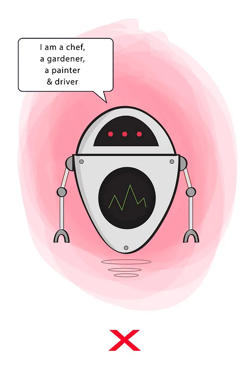
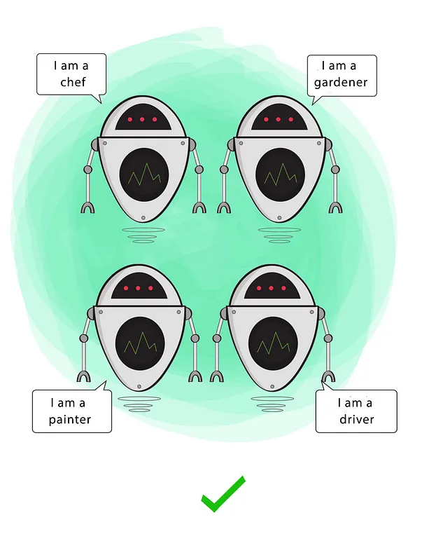

## Uma introdução ao conjunto de princípios fundamentais para 
# O desenvolvimento de software saudável

---

## Princípios solidos

<!-- 

Bons sistemas começam com pequenos pedaços de código limpo. Por outro lado, é possível fazer uma bagunça considerável com vários pequenos pedaços de código limpo. É aí que entram os princípios SOLID.
-->

--- 

## Princípios sólidos
# Organização

<!-- 

  Os principios SOLID nos dizem como organizar as funções e estruturas de dados em classes e como essas classes devem ser interconectadas.

-->


--- 

<div class="cls">
  <div>

  ## Objetivos do 
  # SOLID <!-- fit -->

  </div>
  <div style="padding: 100px 100px 0 0;">

  - Tolerar mudanças
  - Sejam faceis de entender
  - Sejam a base de código que possa ser usada em muitos sistemas de software

  </div>
</div>


<!-- 

Assim como é possivel criar uma bagunça considerável com tijolos bem feitos, 
também é possível bagunçar um sistema inteiro com pedaços de código bem-projetados.

-->

--- 


# SOLID <!-- fit --> 

--- 


    
Robert C Martin (signatário do Manifesto Agil, autor do da série de livros codigo limpo e  desenvolvedor desde a década de 70), vem escrevendo sobre qualidade de software a muito tempo e em 2000 já havia estabelecido um conjunto de princípios e práticas em seus trabalhos e publicações. 

Foi ai que em 2004, Michael Feathers (um importante e antigo desenvolvedor da comunidade C++) percebeu que se reorganizasse os princípios, as primeiras letras de cada principio poderiam formar a palavra SOLID.

Assim nasceu os princípios SOLID.

---


---


# Single <!-- fit -->
# Responsability <!-- fit -->
# Principle <!-- 1fit -->

---


# Principio <!-- 1fit -->
## Responsabilidade <!-- fit -->
# Unica <!-- 1fit -->

---


<div class="cls">
<div style="padding-top: 50%">

``` java

public class Robot {
  void cook() { ... }
  void text() { ... }
  void state() { ... }
  void image() { ... }
  void video() { ... }
  void youtube() { ... }
}
```

</div>
<div >



</div>
</div>

---


<div class="cls">
<div >



</div>
<div>

``` java

public class RobotChef {
  void cook() { ... }
}

public class RobotGarderner {
  void clean() { ... }
}

public class RobotPainter {
  void paint() { ... }
}

public class RobotDriver {
  void drive() { ... }
}

```


</div>
</div>

---


# Open-Closed <!-- fit -->
# Principle <!-- 1fit -->

---


# Princípio <!-- 1fit -->
# Aberto-Fechado <!-- fit -->


---


# Liskov <!-- 1fit -->
# Substitution <!-- fit -->
# Principle <!-- 1fit -->

---


# Princípio <!-- 1fit -->
# Substituição <!-- fit -->
# Liskov <!-- 1fit -->

---


# Interface <!-- 1fit -->
# Segregation <!-- fit -->
# Principle <!-- 1fit -->

---


# Princípio <!-- 1fit -->
# Segregação <!-- fit -->
# Interface <!-- 1fit -->


---


# Dependency <!-- 1fit -->
## Inversion <!-- fit -->
# Principle <!-- 1fit -->

---


# Princípio <!-- 1fit -->
# Inversão <!-- fit -->
# Dependência <!-- 1fit -->

---

